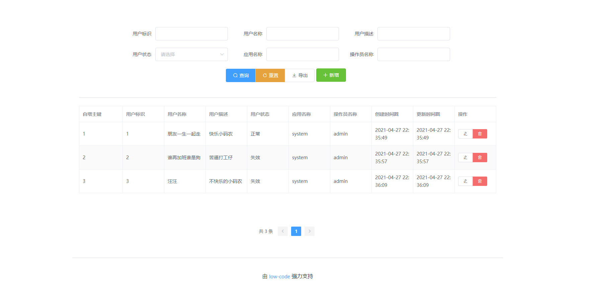

# low-code

[low-code](https://github.com/houbb/low-code) 是一款为 java 打造的低代码平台。

## 特性

- 支持基本的增删改查

- 支持 EXCEL 导出

- 代码一键生成

- 生产代码一键清理

## 技术选型

springboot 容器

mybatis-plus+druid+mysql 数据库

vue+element-ui 页面

## 变更日志

[变更日志](CHANGELOG.md)

# 快速开始

## 需要

jdk 1.7+

maven 3.x+

mysql 5.7

## 配置调整

此处使用的是 mysql-5.7，数据库脚本见 [mysql-5.7.sql](https://github.com/houbb/low-code/blob/master/low-code-dal/src/main/resources/sql/mysql-5.7.sql)

在 mysql 中执行上述脚本，默认的 mysql 登录信息为 root/123456。

如果需要调整，修改 [application.yml](https://github.com/houbb/low-code/blob/master/low-code-web/src/main/resources/application.yml) 文件。

## 启动

直接运行 Application#main() 方法，即可启动应用。

## 首页

## 生成示例

# 分支特性

[v0.0.1-基本 dal 等实现](https://github.com/houbb/low-code/tree/release_0.0.1)

[v0.0.2-实现增删改等功能](https://github.com/houbb/low-code/tree/release_0.0.2)

[v0.0.3-实现分页查询](https://github.com/houbb/low-code/tree/release_0.0.3)

[v0.0.4-实现 EXCEL 导出](https://github.com/houbb/low-code/tree/release_0.0.4)

[v0.0.5-实现枚举值映射](https://github.com/houbb/low-code/tree/release_0.0.5)

# 拓展阅读

# 后期 Road-MAP

- [ ] 根据 @TableId 获取对应的 id 字段

- [ ] 批量删除

- [ ] 新增/更新时过滤 id 和时间

- [ ] 时间类型查询优化(date 控件)

- [ ] 导入功能

- [ ] 动态菜单 + 下载中心

- [ ] EXCEL 导出枚举值处理

- [x] 枚举值的统一处理

- [x] 依赖名称生成更加优雅，变为首字母小写

- [x] 导出功能

- [x] 查询功能

## 数据源

- [ ] 其他数据库支持

- [ ] 其他前端语言支持

- [ ] 其他后端语言支持

## 自动生成

- gen-test-plugin 接入

- swagger 接入

- JAPIDocs 接入

## 可视化

- 页面化

- 高度定制化